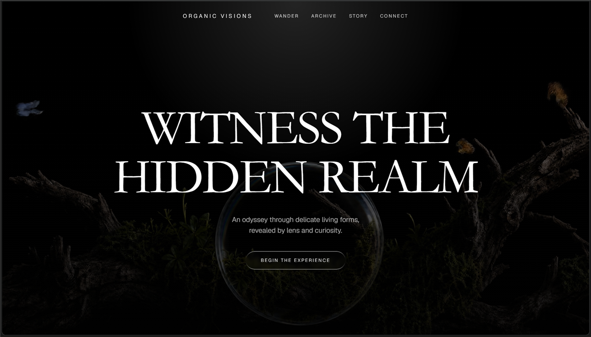
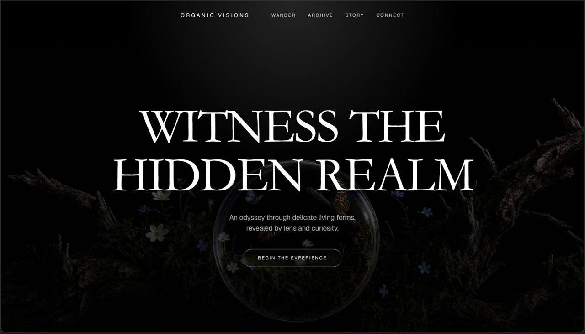

# Blossom Background

Cinematic full-screen hero section built with React, TypeScript, Tailwind CSS, and Framer Motion, powered by Vite.

## Preview

Check out the design themes below:

| Dark Orb Theme | Floral Orb Theme |
| :---: | :---: |
|  |  |

## Stack & Technologies

- **React 19** - Modern UI library
- **TypeScript** - Strict type-safety
- **Vite** - High-performance frontend build tooling
- **Tailwind CSS** - Clean, utility-first CSS styling
- **Framer Motion 12** - Fluid animations & staggered text/button entrance transitions
- **Lucide React** - Minimalist icons

## Usage & Development

### 1. Installation

Install all required node packages and dependencies:

```bash
npm install
```

### 2. Run Development Server

Launch the Vite local development environment:

```bash
npm run dev
```

### 3. Build for Production

Compile and optimize the source assets for production deployment:

```bash
npm run build
```

### 4. Local Preview

Start a local server to preview the compiled production build:

```bash
npm run preview
```

## Project Structure

Here is an overview of the codebase architecture and key configuration files:

```text
blossom/
├── images/
│   ├── favicon.png             # Site favicon for browser tabs
│   ├── blossom_favicon.png     # Full-resolution blossom project icon/logo
│   ├── preview-dark-orb.png    # Preview screenshot (Dark Orb theme)
│   └── preview-floral-orb.png  # Preview screenshot (Floral Orb theme)
├── src/
│   ├── App.tsx                 # Main application layout, components & animation definitions
│   ├── index.css               # Global CSS, custom styles & Tailwind directives
│   ├── main.tsx                # Application bootstrap entry point
│   └── vite-env.d.ts           # TypeScript environment configuration for Vite
├── .env                        # Local environment variables (e.g., VITE_HERO_VIDEO_URL)
├── .gitignore                  # Version control ignored files/directories
├── index.html                  # HTML5 boilerplate entry document
├── LICENSE                     # MIT License file
├── package.json                # Project script registry, dependencies, and metadata
├── postcss.config.js           # PostCSS compilation setup for Tailwind CSS
├── README.md                   # Project documentation and guide
├── tailwind.config.js          # Tailwinds customization file
├── tsconfig.json               # TypeScript compiler config
└── vite.config.ts              # Vite compiler configuration
```

## Configuration & Notes

- **Hero Background Video**: The background loop video URL is fetched dynamically from the environment configuration. Define it in your `.env` file using the key `VITE_HERO_VIDEO_URL`.
- **Favicon**: The browser favicon is loaded from the asset directory at `images/favicon.png`.

## License and Copyrights

This project is open-source software licensed under the terms of the **MIT License**.

### Copyright Notice

```text
Copyright (c) 2026 Sajid
```

### License Terms

<details>
<summary><b>Click to expand full MIT License text</b></summary>

```text
MIT License

Copyright (c) 2026 Sajid

Permission is hereby granted, free of charge, to any person obtaining a copy
of this software and associated documentation files (the "Software"), to deal
in the Software without restriction, including without limitation the rights
to use, copy, modify, merge, publish, distribute, sublicense, and/or sell
copies of the Software, and to permit persons to whom the Software is
furnished to do so, subject to the following conditions:

The above copyright notice and this permission notice shall be included in all
copies or substantial portions of the Software.

THE SOFTWARE IS PROVIDED "AS IS", WITHOUT WARRANTY OF ANY KIND, EXPRESS OR
IMPLIED, INCLUDING BUT NOT LIMITED TO THE WARRANTIES OF MERCHANTABILITY,
FITNESS FOR A PARTICULAR PURPOSE AND NONINFRINGEMENT. IN NO EVENT SHALL THE
AUTHORS OR COPYRIGHT HOLDERS BE LIABLE FOR ANY CLAIM, DAMAGES OR OTHER
LIABILITY, WHETHER IN AN ACTION OF CONTRACT, TORT OR OTHERWISE, ARISING FROM,
OUT OF OR IN CONNECTION WITH THE SOFTWARE OR THE USE OR OTHER DEALINGS IN THE
SOFTWARE.
```

</details>
